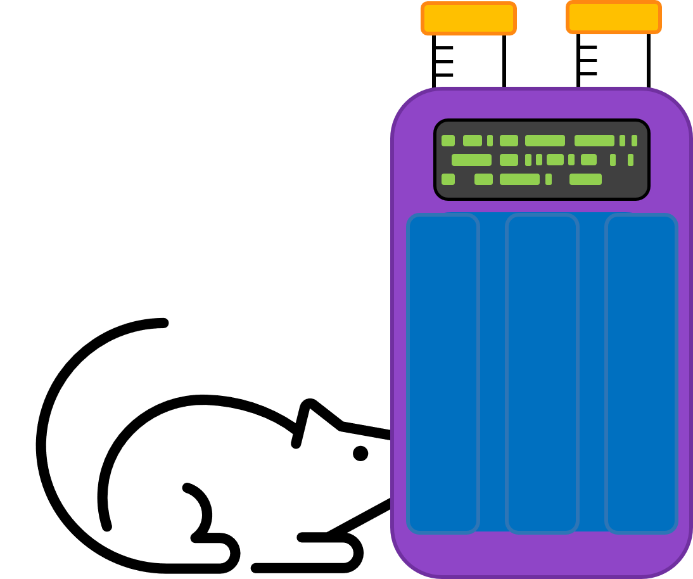

# SipperViz

	

**Sippers** are 3D-printed, open-source devices for measuring liquid ingestion in rodents.  Sippers were developed in the [Creed](https://www.creedlab.org/) and [Kravitz](https://kravitzlab.com/) Labs at Washington University.  You can visit [hackaday](https://hackaday.io/project/160388-automated-mouse-homecage-two-bottle-choice-test-v2) to learn how to build Sippers, and see [this publication](https://doi.org/10.1523/ENEURO.0292-19.2019) for a description of their use

**SipperViz** is a Python GUI for graphing data produced by Sippers.  SipperViz can be used to:

- Create plots visualizing drink frequency and duration
- Label and assign liquids associated with Sipper recordings
- Average data from different recordings based on the bottle, liquid, or experimental group
- Concatenate data from different recordings
- Return the data and code used to create plots

SipperViz is a `tkinter` application which uses Python's [`matplotlib`](https://matplotlib.org/) and [`seaborn`](https://seaborn.pydata.org/) packages to create visualizations. 

Check out [FED3 Viz](https://github.com/earnestt1234/FED3_Viz) for a related project.

### Usage

See the [releases page](https://github.com/earnestt1234/SipperViz/releases) to get the latest version of SipperViz.  The [`Installation.md`](https://github.com/earnestt1234/SipperViz/blob/master/Installation.md) file has instructions on how to run SipperViz as either an executable or a Python script.

This work is licensed under a [Creative Commons Attribution 4.0 International
License][cc-by].

[![CC BY 4.0][cc-by-image]][cc-by]

[cc-by]: http://creativecommons.org/licenses/by/4.0/
[cc-by-image]: https://i.creativecommons.org/l/by/4.0/88x31.png
[cc-by-shield]: https://img.shields.io/badge/License-CC%20BY%204.0-lightgrey.svg

